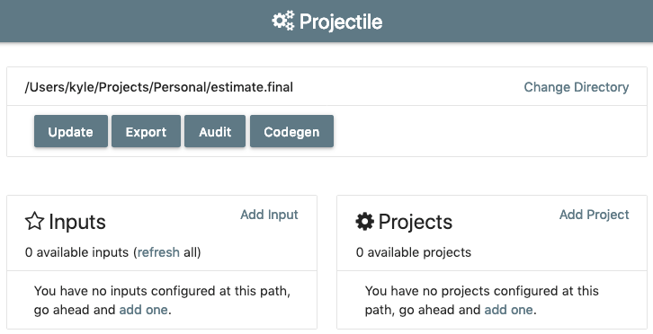
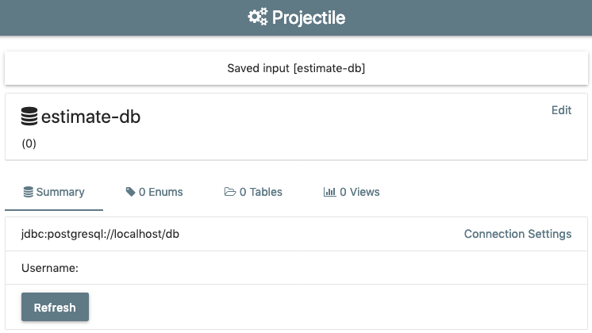
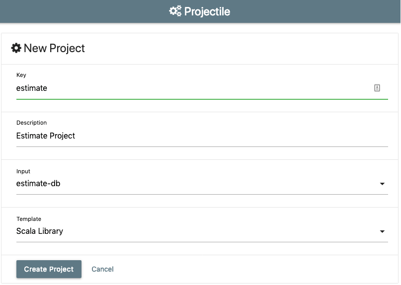
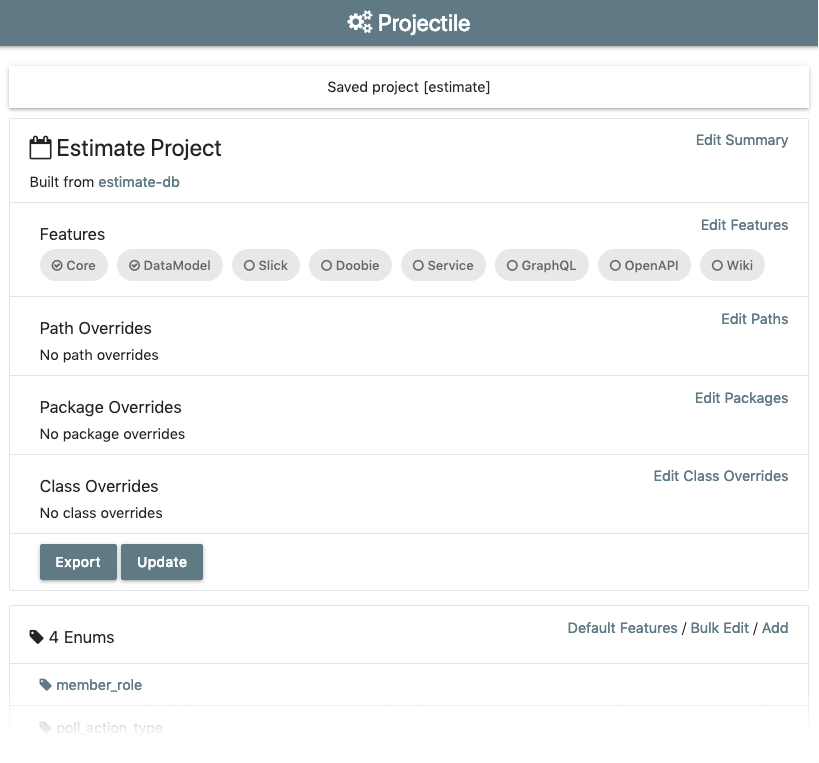

# Configuring Projectile

@@@ note { title=Prerequisites }

This page assumes you have checked out a local copy of [estimate.poker](https://github.com/KyleU/estimate), 
switched to the `02-database-setup` branch,
and have created a database as described in the @ref[previous tutorial step](02-database-setup.md)

@@@

Now that we have a working project, let's get Projectile configured so we can start generating code.

There's a semi-functional command-line interface, but it's poorly documented, so we'll use the UI provided by Projectile.

Using one of the methods described in @ref[Getting Started](../../gettingStarted/index.md), launch the projectile server, and open http://localhost:20000

If all goes well, you should see a screen like this:

Select the "Add Input" link, and fill out the form like so:

Once you save the connection, you're brought to the connection details screen. We need to configure the database connection.

Click "Connection Settings" and fill in the correct url and credentials.
If you ran the initial database creation script from @ref[step 2](02-database-setup.md), use "estimate" as the database, username, and password.
Return to the input detail screen, and click the "Refresh" button. 
It will hopefully connect to the database and return something looking like this:

Note that there's 11 tables and some enums too. Feel free to click around and explore the input definition. 
When you're ready, return to the [Projectile homepage](http://localhost:20000), where we'll create a project.

Create a new project by clicking the "Add Project" link, and filling out the form thusly:

Now you'll be at the main project screen. Get used to it, you'll be seeing it a lot.

You should have four enums and eleven models. We already have two features enabled, "Core" and "DataModel". 
When we run the export, those two features will create Scala case classes for all of the project's enums and tables.

## Explore the code

https://github.com/KyleU/estimate/tree/03-configuring-projectile   

See this branch's Pull Request for detailed comments on the project and input configuration files

https://github.com/KyleU/estimate/pull/3

## Next steps

We're ready to generate some code, so @ref[get going](04-basic-codegen.md)!
