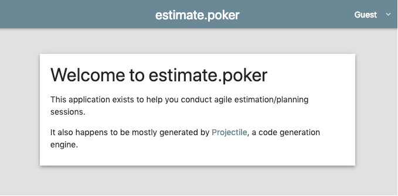

# Web Application

@@@ note { title=Prerequisites }

This page assumes you have checked out a local copy of [estimate.poker](https://github.com/KyleU/estimate) and switched to the `05-more-features` branch

@@@

So we currently have a pretty great little console app that lets us work with the database, but a [Play Framework](https://www.playframework.com) web application would be even cooler


## Scala build definition

Now is as good a time as any to move from `.sbt` files to a Scala build. First let's add the Play plugin and a few others:

Change your `project/plugins.sbt` to match [this](https://github.com/KyleU/estimate/blob/06-web-application/project/plugins.sbt)

Now, create three new files in `/project`:

- [`project/Common.scala`](https://github.com/KyleU/estimate/blob/06-web-application/project/Common.scala)
- [`project/Dependencies.scala`](https://github.com/KyleU/estimate/blob/06-web-application/project/Dependencies.scala)
- [`project/Server.scala`](https://github.com/KyleU/estimate/blob/06-web-application/project/Server.scala)

And, finally, change your `build.sbt` to match [this](https://github.com/KyleU/estimate/blob/06-web-application/build.sbt) single line


## Housekeeping

@@@ warning { title=Disclaimer }

This next part is very boring. We're going to switch Projectile's configuration to a Play app, regenerate the files, and audit to clean up the old stuff.

If you want to skip this section, checkout the git tag [`06-web-application-housekeeping`](https://github.com/KyleU/estimate/tree/06-web-application-housekeeping), where these steps have already been performed.

@@@

Play Framework projects use `app` for the source root. 
We've been using `src/main/scala` up to this point, so we'll need to change Projectile to expect a Play app's setup.
Open the [project details](http://localhost:20000/project/estimate) page, and select "Edit Summary". 

Change the template from "Scala Library" to "Play Framework", and save changes. Now the directories are set up correctly, but our old files still exist.

Export the project, then audit and fix all to remove the old files. You'll also need to move `application.conf` to `/conf`, and you may as well delete `Entrypoint`

Compile, and you should be able to `run` in sbt to start the server (though it'll only throw 404s for now)


## Configuration

@@@ warning { title=Disclaimer }

This next part is very boring. We're going to add a Play controller, routes file, and Twirl template. 

If you want to skip this section, checkout the git branch [`06-web-application`](https://github.com/KyleU/estimate/tree/06-web-application), where these steps have already been performed.

@@@

Now that we've converted to Play, we'll need to configure some stuff before we can use the Projectile web libraries. 

`conf/application.conf` can slim down:

```
projectName = "estimate"
secretKey = "change_this_secret_key"

include "projectile-auth.conf"

play {
  modules.enabled += "models.ProjectileModule"
  server.http.port = 24000
}
```

Then add the following files:

- [`app/assets/stylesheets/main.less`](https://github.com/KyleU/estimate/blob/06-web-application/app/assets/stylesheets/main.less): Basic styles for our app
- [`app/controllers/HomeController.scala`](https://github.com/KyleU/estimate/blob/06-web-application/app/controllers/HomeController.scala): A Play Framework controller supporting authentication
- [`app/models/ProjectileModule.scala`](https://github.com/KyleU/estimate/blob/06-web-application/app/models/ProjectileModule.scala): A Guice module that injects a few classes needed by `projectile-lib-auth`
- [`app/util/Config.scala`](https://github.com/KyleU/estimate/blob/06-web-application/app/util/Config.scala): A simple class to track our project info
- [`app/views/index.scala.html`](https://github.com/KyleU/estimate/blob/06-web-application/app/views/index.scala.html): A basic home page, using the base template from `projectile-lib-auth`
- [`conf/routes`](https://github.com/KyleU/estimate/blob/06-web-application/conf/routes): This wires up the authentication routes and HomeController's lone action


## Success!

If we've got everything set up correctly, we should have a web application with authentication and a Material Design theme.



You can sign up for a local account using the menu in the upper right. The "admin" link is broken right now, that's what we'll fix next

## Explore the code

https://github.com/KyleU/estimate/tree/06-web-application

See this branch's Pull Request for detailed comments on the modified files

https://github.com/KyleU/estimate/pull/6


## Next steps

TODO
