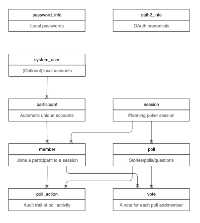

# estimate.poker

@@@ index

* [Hello World](01-hello-world.md)
* [Database Setup](02-database-setup.md)
* [Adding Projectile](03-configuring-projectile.md)
* [Basic Codegen](04-basic-codegen.md)
* [More Features](05-more-features.md)
* [Web Application](06-web-application.md)
* [Admin Site](07-admin-site.md)
* [Scala.js](08-scala-js.md)
* [Websocket](09-websocket.md)
* [Planning Poker](10-planning-poker.md)
* [Wrapping Up](11-wrapping-up.md)

@@@

The estimate.poker tutorial will start with a "Hello World" Scala application, set up a PostgreSQL database, add Projectile, generate more and more features, and finally produce a web application with:

- Websocket transport of shared Scala classes for real-time client updates
- Play Framework admin site with UI for data access, search, and mutations
- Full GraphQL API, with a schema visualizer and query IDE 
- Code generated services to reduce CRUD boilerplate

## Demo site

You can see the end result of this tutorial at https://estimate.poker

## Source code

The source code for this project is available at https://github.com/KyleU/estimate

## Overview

- @ref[Hello World](01-hello-world.md) will help you clone and build an initial Scala sbt project
- @ref[Database Setup](02-database-setup.md) guides you though configuring a new postgres database
- @ref[Configuring Projectile](03-configuring-projectile.md) configures Projectile and get your first project set up
- @ref[Basic Codegen](04-basic-codegen.md) will create our first generated classes using Projectile
- @ref[More Features](05-more-features.md) adds database queries, services, a GraphQL endpoint
- @ref[Web Application](06-web-application.md) will turn our console-based duckling into a beautiful web swan
- @ref[Admin Site](07-admin-site.md) generates a full-feature admin site and GraphQL API
- @ref[Scala.js](08-scala-js.md) creates a Scala.js project and shared code cross-compiled to Scala.js 
- @ref[Websocket](09-websocket.md) builds a websocket transport for shared messages, Scala.js logic, and a few simple views
- @ref[Planning Poker](10-planning-poker.md) finally builds on what we've created to make a real planning poker app
- @ref[Wrapping Up](11-wrapping-up.md) TODO

## Database schema

The schema is created by a flyway migration, available [here](https://github.com/KyleU/estimate/blob/master/conf/db/migration/V1__InitialSchema.sql)

